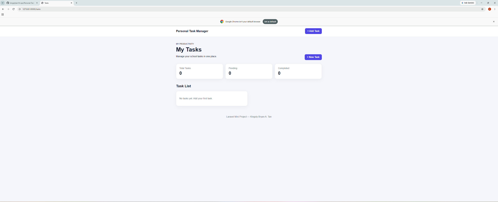
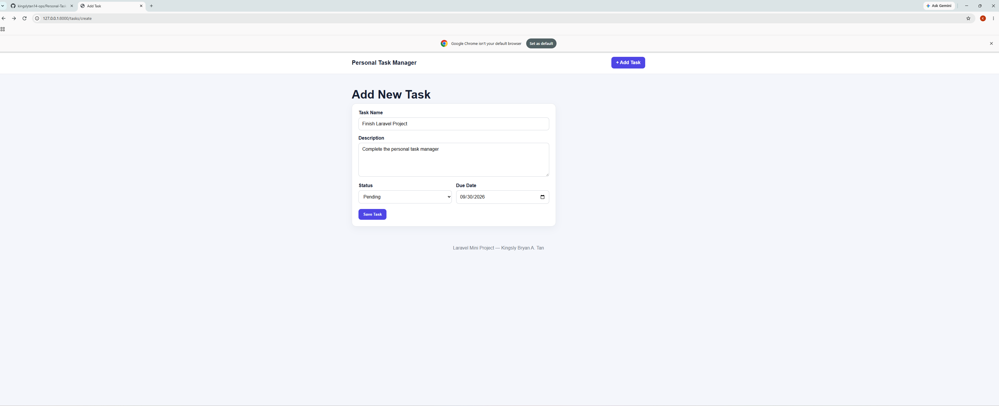
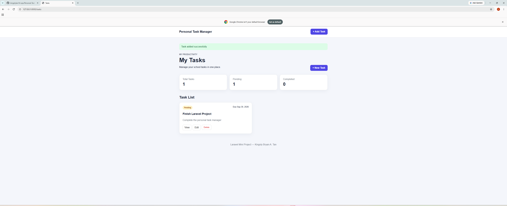
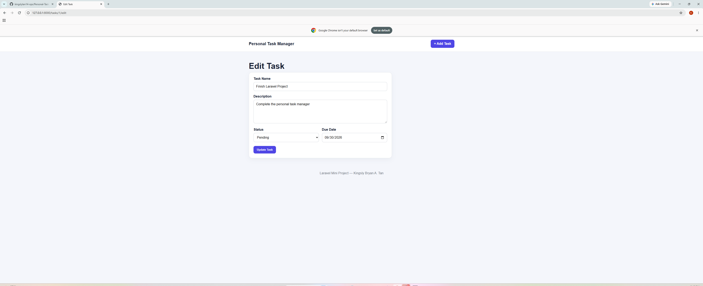
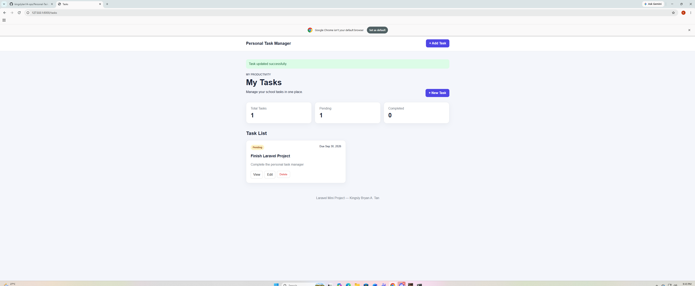
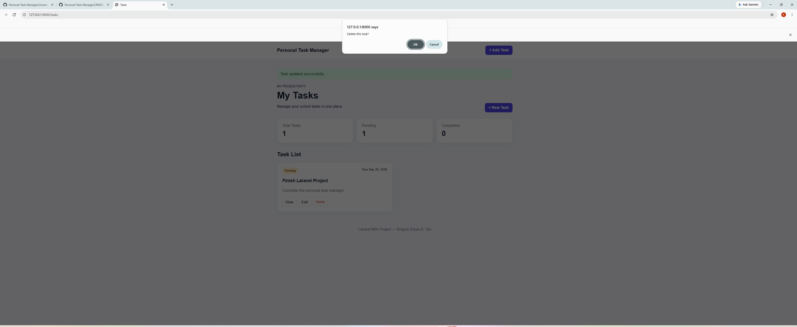

# Personal Task Manager

## Student Information

* **Project Code:** WST21-PM-2026-SF
* **Student Name:** Kingsly Bryan A. Tan
* **Course & Year:** BSIT - 2nd Year
* **Database Used:** MySQL
* **Local Environment:** XAMPP

## Project Description

Personal Task Manager is a simple Laravel project that I made to help manage tasks. It allows the user to add tasks, view tasks, edit them, change their status, and delete them.

## Features

* Add Task
* View Task
* Edit Task
* Delete Task
* Update Status

## Technologies Used

* Laravel
* PHP
* MySQL
* Blade
* HTML
* CSS
* XAMPP

## How the System Works

### 1. Open the System

When the system is opened, the dashboard shows the task list and the task counters.

### 2. Add a Task

The user clicks **Add New Task** and enters the task name, description, status, and due date. After clicking the submit button, the task is saved in the database.

### 3. View Tasks

The added task will appear in the task list. The dashboard also shows the number of total, pending, and completed tasks.

### 4. Edit a Task

The user can click **Edit** to change the information of a task. After saving, the changes will appear in the task list.

### 5. Change Status

The user can change the task status from **Pending** to **Completed**.

### 6. Delete a Task

The user can click **Delete** to remove a task from the list.

## Laravel Flow

This is how the main parts of the project work together:

```text
User
 ↓
Blade
 ↓
Route
 ↓
Controller
 ↓
Model
 ↓
MySQL
 ↓
Blade
 ↓
User
```

## Laravel Code

### 1. Routes

File:

```text
routes/web.php
```

Code:

```php
<?php

use Illuminate\Support\Facades\Route;
use App\Http\Controllers\TaskController;

Route::resource('tasks', TaskController::class);
```

The route connects the website pages to the TaskController.

### 2. Task Model

File:

```text
app/Models/Task.php
```

Code:

```php
<?php

namespace App\Models;

use Illuminate\Database\Eloquent\Model;

class Task extends Model
{
    protected $fillable = [
        'task_name',
        'description',
        'status',
        'due_date',
    ];
}
```

The model is used to work with the task data in MySQL.

### 3. Task Controller

File:

```text
app/Http/Controllers/TaskController.php
```

Code:

```php
<?php

namespace App\Http\Controllers;

use App\Models\Task;
use Illuminate\Http\Request;

class TaskController
{
    public function index()
    {
        $tasks = Task::orderByRaw(
            "CASE WHEN status = 'Pending' THEN 0 ELSE 1 END"
        )
        ->orderBy('due_date')
        ->get();

        $totalTasks = Task::count();
        $pendingTasks = Task::where('status', 'Pending')->count();
        $completedTasks = Task::where('status', 'Completed')->count();

        return view('tasks.index', compact(
            'tasks',
            'totalTasks',
            'pendingTasks',
            'completedTasks'
        ));
    }

    public function create()
    {
        return view('tasks.create');
    }

    public function store(Request $request)
    {
        $data = $request->validate([
            'task_name' => 'required|string|max:255',
            'description' => 'nullable|string',
            'status' => 'required|in:Pending,Completed',
            'due_date' => 'required|date',
        ]);

        Task::create($data);

        return redirect()
            ->route('tasks.index')
            ->with('success', 'Task added successfully.');
    }

    public function show(Task $task)
    {
        return view('tasks.show', compact('task'));
    }

    public function edit(Task $task)
    {
        return view('tasks.edit', compact('task'));
    }

    public function update(Request $request, Task $task)
    {
        $data = $request->validate([
            'task_name' => 'required|string|max:255',
            'description' => 'nullable|string',
            'status' => 'required|in:Pending,Completed',
            'due_date' => 'required|date',
        ]);

        $task->update($data);

        return redirect()
            ->route('tasks.index')
            ->with('success', 'Task updated successfully.');
    }

    public function destroy(Task $task)
    {
        $task->delete();

        return redirect()
            ->route('tasks.index')
            ->with('success', 'Task deleted successfully.');
    }
}
```

The controller handles the main actions of the system like adding, viewing, editing, updating, and deleting tasks.

### 4. Database Migration

File:

```text
database/migrations/create_tasks_table.php
```

Code:

```php
Schema::create('tasks', function (Blueprint $table) {
    $table->id();
    $table->string('task_name');
    $table->text('description')->nullable();
    $table->enum('status', ['Pending', 'Completed'])
          ->default('Pending');
    $table->date('due_date');
    $table->timestamps();
});
```

This code creates the `tasks` table in MySQL.

### 5. Blade View

Main file:

```text
resources/views/tasks/index.blade.php
```

Example:

```php
@foreach($tasks as $task)
    {{ $task->task_name }}
@endforeach
```

Blade is used to show the task information on the website.

## CRUD

The project uses CRUD:

| CRUD   | What it does  |
| ------ | ------------- |
| Create | Add a task    |
| Read   | View tasks    |
| Update | Edit a task   |
| Delete | Delete a task |

## Database

The database used for this project is **MySQL**.

Database name:

```text
task_manager
```

Table:

```text
tasks
```

The table contains:

```text
id
task_name
description
status
due_date
created_at
updated_at
```

## System Screenshots

### Dashboard



### Add New Task



### Task List



### Edit Task



### Completed Task



### Delete Task



## System Outputs

### Add Task

The task is added and shown in the task list.

### Edit Task

The task information is updated after editing.

### Completed Task

The task status changes from Pending to Completed.

### Delete Task

The selected task is removed from the task list.

### Dashboard

The dashboard shows the total, pending, and completed tasks.

## Project Structure

```text
Personal-Task-Manager-Laravel/
│
├── app/
│   ├── Http/
│   │   └── Controllers/
│   │       └── TaskController.php
│   └── Models/
│       └── Task.php
│
├── database/
│   └── migrations/
│       └── create_tasks_table.php
│
├── resources/
│   └── views/
│       └── tasks/
│           ├── index.blade.php
│           ├── create.blade.php
│           ├── edit.blade.php
│           └── show.blade.php
│
├── routes/
│   └── web.php
│
├── composer.json
├── Dockerfile
└── README.md
```

## How to Run the Project

### Step 1: Start MySQL

Make sure the **MySQL267** service is running.

### Step 2: Open Command Prompt

Go to the project folder:

```cmd
cd /d "C:\Users\kings\OneDrive\Desktop\Personal-Task-Manager-Laravel"
```

### Step 3: Start Laravel

Run:

```cmd
set PATH=C:\xampp\php;%PATH% && php artisan serve
```

### Step 4: Open the Website

Open your browser and enter:

```text
http://127.0.0.1:8000/tasks
```

### Step 5: Use the System

After opening the website, I can add, view, edit, change the status, and delete tasks.

## Notes

The `vendor` folder and `.env` file are not included in the repository.

The `vendor` folder is generated by Composer, while `.env` contains the local database and application settings.
